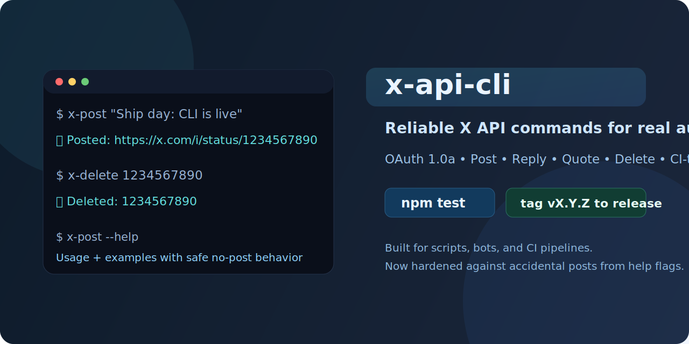
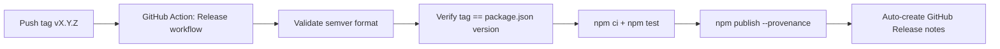

# x-api-cli

<p align="center">
  
</p>

<p align="center">
  
  
  
  
</p>

CLI for posting and deleting tweets through the official X API v2 (OAuth 1.0a), built for scripting and CI usage.

## Why this CLI

- Safe defaults: help and invalid flag paths never trigger API writes.
- Predictable errors: strict flag parsing and strict credential validation.
- Script friendly: stable exit codes for CI and automation.
- Release ready: CI + semver-tagged npm publish workflow included.

## Quick Start

### 1) Install

```bash
git clone https://github.com/your-username/x-api-cli.git
cd x-api-cli
npm install
npm link
```

### 2) Configure credentials

Option A: environment variables (recommended)

```bash
export X_API_KEY="your-consumer-key"
export X_API_SECRET="your-consumer-secret"
export X_ACCESS_TOKEN="your-access-token"
export X_ACCESS_SECRET="your-access-token-secret"
```

Option B: `x-api.json`, `.x-api.json`, or `~/.config/x-api.json`

```json
{
  "consumerKey": "your-consumer-key",
  "consumerSecret": "your-consumer-secret",
  "accessToken": "your-access-token",
  "accessTokenSecret": "your-access-token-secret"
}
```

You can also use a custom path:

```bash
x-post --config ./secrets/x-api.json "hello from config"
x-delete --config ./secrets/x-api.json 1234567890
```

Or set:

```bash
export X_API_CONFIG="./secrets/x-api.json"
```

## Command Gallery

```bash
# Post
x-post "Hello world from CLI"

# Reply
x-post "Replying to this" --reply-to 1234567890

# Quote by tweet ID
x-post "Read this thread" --quote 1234567890

# Quote by URL
x-post "Read this thread" --quote-url https://x.com/user/status/1234567890

# Delete one or many
x-delete 1234567890
x-delete 1234567890 2345678901 3456789012

# Help
x-post --help
x-delete --help
```

## Safety Behaviors

- `--help` always exits with status `0` and no API requests.
- Unknown flags return status `1` and clear usage guidance.
- Missing/partial credentials fail early before API calls.
- `x-delete` exits non-zero when any deletion fails.

## Development

```bash
npm test
```

Tests cover parsing, credential resolution, and edge cases in `test/x-cli-common.test.mjs`.

## Release Pipeline (SemVer Tags)

Workflow: `.github/workflows/release.yml`



### One-time setup

1. Configure one npm auth strategy:
   `Option A:` Add `NPM_TOKEN` as a repository secret in GitHub.
   `Option B:` Configure npm Trusted Publishing for this GitHub repo/workflow (OIDC).
2. Ensure the package name (`x-api-cli`) is available to publish on npm.
3. Keep `version` in `package.json` aligned with your next tag.

### Ship a release

```bash
# choose one
npm version patch
npm version minor
npm version major

git push origin HEAD --follow-tags
```

Tag format must be `vMAJOR.MINOR.PATCH` (for example: `v1.1.0`).

## Security Notes

- Do not commit credential files.
- `x-api.json` and `.x-api.json` are ignored by default.
- Prefer environment variables in CI.

## License

MIT
