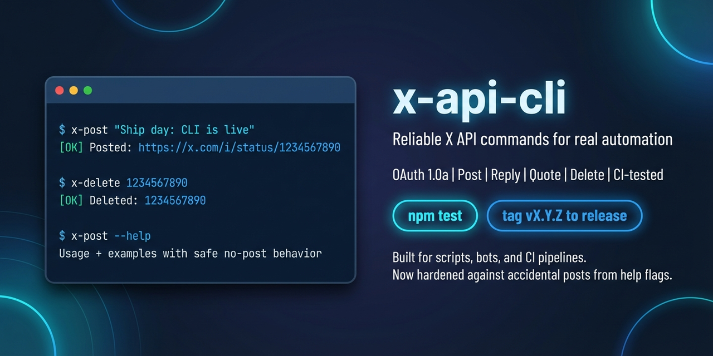

# x-api-cli

<p align="center">
  
</p>

<p align="center">
  <a href="https://www.npmjs.com/package/x-api-cli"></a>
  <a href="https://www.npmjs.com/package/x-api-cli"></a>
  <a href="https://github.com/eliaseffects/x-api-cli/actions/workflows/ci.yml"></a>
  
  
</p>

Post and delete tweets from the terminal using the official X API v2 with OAuth 1.0a user tokens.

Commands:

- `x-post`
- `x-delete`

## Why this CLI

- Safe defaults: help and invalid flag paths never trigger API writes.
- Predictable errors: strict flag parsing and strict credential validation.
- Script friendly: stable exit codes for CI and automation.
- Release ready: CI + semver-tagged releases + publish automation.

## Install

### npm (recommended)

```bash
npm install -g x-api-cli
x-post --help
x-delete --help
```

### Homebrew (macOS/Linux)

```bash
brew tap eliaseffects/tap
brew install x-api-cli
```

### From source (development)

```bash
git clone https://github.com/eliaseffects/x-api-cli.git
cd x-api-cli
npm install
npm link
```

## Configure credentials

You need an X developer app with read/write access and user access tokens (OAuth 1.0a).
Get them from the X Developer Portal: https://developer.x.com/en/portal/dashboard

### Environment variables (recommended)

```bash
export X_API_KEY="your-consumer-key"
export X_API_SECRET="your-consumer-secret"
export X_ACCESS_TOKEN="your-access-token"
export X_ACCESS_SECRET="your-access-token-secret"
```

All 4 variables must be set together.

### Config file

Create a JSON file with:

```json
{
  "consumerKey": "your-consumer-key",
  "consumerSecret": "your-consumer-secret",
  "accessToken": "your-access-token",
  "accessTokenSecret": "your-access-token-secret"
}
```

Then use one of these options:

```bash
# Explicit path
x-post --config ./secrets/x-api.json "hello from config"

# Or env var
export X_API_CONFIG="./secrets/x-api.json"
```

Search order for config files:

- `--config <path>`
- `$X_API_CONFIG`
- `./x-api.json`
- `./.x-api.json`
- `~/.config/x-api.json`

Optional legacy support (only if you set `X_API_USE_LEGACY_PATHS=1`):

- `~/.clawdbot/secrets/x-api.json`

## Usage

```bash
# Post
x-post "Hello world from CLI"

# Reply
x-post "Replying to this" --reply-to 1234567890

# Quote by tweet ID
x-post "Read this thread" --quote 1234567890

# Quote by URL
x-post "Read this thread" --quote-url https://x.com/user/status/1234567890

# Delete one or many
x-delete 1234567890
x-delete 1234567890 2345678901 3456789012

# Text that begins with a dash
x-post -- "--not-a-flag"

# Help
x-post --help
x-delete --help
```

## Safety Behaviors

- `--help` always exits with status `0` and no API requests.
- Unknown flags return status `1` and clear usage guidance.
- Missing/partial credentials fail early before API calls.
- `x-delete` exits non-zero when any deletion fails.

## Troubleshooting

- `No credentials found`
  Set the env vars or create one of the supported config files.
- `403/401` from X API
  Your app/tokens likely lack write permissions, are expired, or are from a different app.
- `Invalid tweet ID`
  Tweet IDs must be numeric. Use `--quote-url` if you have a URL.

## Development

```bash
npm test
```

Tests cover parsing, credential resolution, and edge cases in `test/x-cli-common.test.mjs`.

## Security Notes

- Do not commit credential files.
- `x-api.json` and `.x-api.json` are ignored by default.
- Prefer environment variables in CI.

<details>
<summary>Maintainers</summary>

Releasing (SemVer tags):

```bash
npm version patch
git push origin HEAD --follow-tags
```

GitHub Actions runs `.github/workflows/release.yml` and publishes to npm.

Trusted publishing:

- Configure a trusted publisher in npm for `eliaseffects/x-api-cli` with workflow `release.yml`.
- Set repo variable: `NPM_TRUSTED_PUBLISHING=true`
- Remove `NPM_TOKEN` after bootstrap.

</details>

## License

MIT
